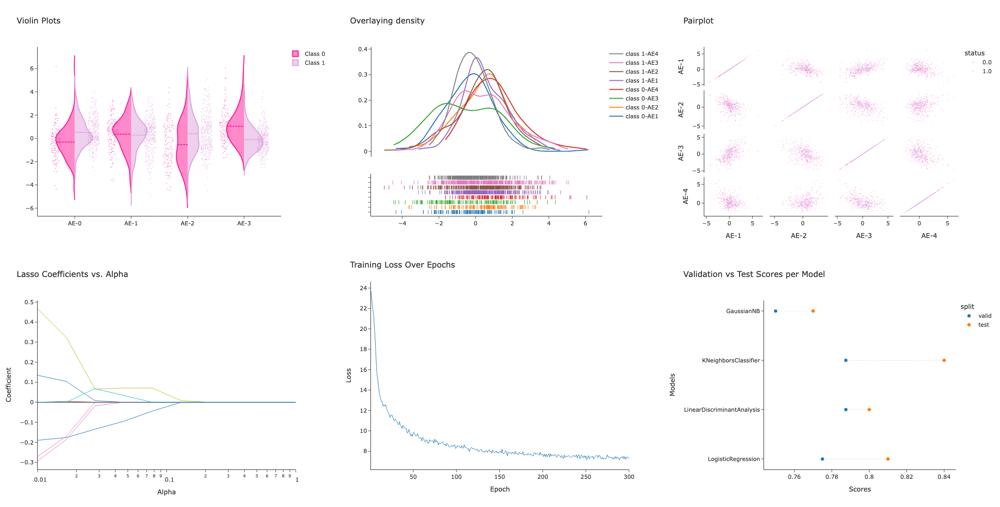

# ML notebooks go here

## Parkinson's Disease Detection

This notebook dives into using machine learning techniques to diagnose Parkinson's Disease based on biomedical voice measurements. Key highlights include:

- Exploratory Data Analysis

  - Distribution analysis with density plots and violin plots
  - Relationship exploration with pairplots and correlation heatmaps

- Feature Importance Analysis

  - Using Lasso Regression to identify key predictors
  - Visualizing predictor coefficients across regularization strengths

- Synthetic Data Generation

  - Leveraging Variational Autoencoders to create realistic synthetic samples
  - Evaluating quality and diversity of generated data

- Dimensionality Reduction

  - Applying PCA and t-SNE for intuitive 2D/3D visualizations
  - Identifying potential clusters and separability of classes

- Predictive Modeling

  - Training and tuning multiple classification algorithms
  - Detailed model evaluation with metrics, learning curves, and confusion matrices
